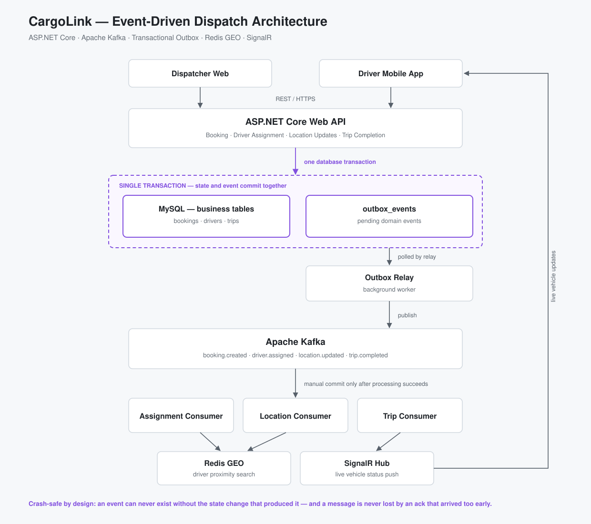

# CargoLink

A real-time dispatch system for trucking and container transport, built on ASP.NET Core with an
event-driven backend. It keeps booking state, driver assignment and live vehicle location consistent
across services — including when a service crashes mid-write.



## The problem this solves

A single dispatch action touches several things at once: a booking is created, a driver is assigned,
location updates start streaming, and the trip eventually closes.

If the database write and the published event are two separate operations, a crash between them
leaves the system permanently inconsistent — an event with no data behind it, or a state change no
other service ever hears about. Retrying naively then creates the opposite problem: the same event
processed twice.

## Architecture decisions

**Transactional Outbox instead of publishing directly.**
Domain events are written to an `outbox_messages` table inside the *same* database transaction as
the state change. A background `OutboxPublisher` polls the table and publishes to Kafka. A crash can
no longer produce an event without its data, or data without its event.

**Inbox pattern for idempotent consumption.**
Consumers record processed message ids in an `inbox_messages` table. At-least-once delivery means a
message can legitimately arrive twice; the inbox makes reprocessing a no-op instead of a duplicate
booking.

**Manual consumer commits instead of auto-commit.**
Kafka's default auto-commit acknowledges a message before the handler has finished, so a consumer
that dies mid-processing loses it silently. Offsets are committed only after processing completes —
failures get retried rather than dropped.

**Redis GEO for driver proximity.**
Finding the nearest available drivers to a pickup point is a geospatial query, not a table scan.
Redis GEO keeps it fast as the fleet grows, and the index is rebuilt on startup by
`DriverGeoIndexBootstrapper`.

**SignalR for live state.**
Vehicle status and location are pushed to connected clients through `DispatchHub` rather than
polled.

## Dispatch flow

```
Booking created  ->  outbox_messages (same transaction)
                 ->  OutboxPublisher  ->  Kafka: dispatch.booking.created
                 ->  KafkaDispatchConsumer (inbox check, manual commit)
                 ->  Redis GEO nearby-driver search
                 ->  SignalR push to dispatcher and driver clients

Driver accepts   ->  dispatch.booking.driver-accepted
Trip completes   ->  dispatch.booking.completed
```

## Project layout

```
CargoLink/
├── Controllers/            Auth, Bookings, Drivers endpoints
├── Contracts/              Request and response DTOs
├── Domain/
│   ├── Entities/           Booking, Driver, Vehicle, Outbox/Inbox messages
│   ├── Enums/              BookingStatus, DriverStatus
│   └── Events/             Domain events published to Kafka
├── Infrastructure/
│   ├── Auth/               JWT issuing and validation
│   ├── Data/               EF Core DbContext
│   ├── Events/             Kafka publisher, consumer, outbox publisher
│   └── Redis/              GEO index for driver proximity
├── Services/               Booking, Driver, Auth application services
└── Hubs/                   SignalR DispatchHub
```

## Tech stack

ASP.NET Core 8 Web API · Entity Framework Core (Pomelo MySQL) · Apache Kafka (Confluent.Kafka) ·
Redis · SignalR · JWT Bearer authentication · Swagger · Docker Compose

## Running locally

Start Kafka, Zookeeper and Redis:

```bash
docker compose up -d
```

MySQL runs outside compose — create an empty `cargolink` database on `localhost:3306`.

Copy the configuration template and fill in your own values:

```bash
cp CargoLink/appsettings.json CargoLink/appsettings.Development.json
```

Set at minimum:

- `ConnectionStrings:MySql` — your MySQL credentials
- `Jwt:Key` — any random string of 32 characters or more

`appsettings.Development.json` is gitignored, so real credentials never leave your machine.

Then run:

```bash
dotnet restore
dotnet run --project CargoLink
```

Swagger UI is served at the application root. Kafka topics are created on startup by
`KafkaTopicInitializer`, and seed data is inserted by `AppDataSeeder`.
